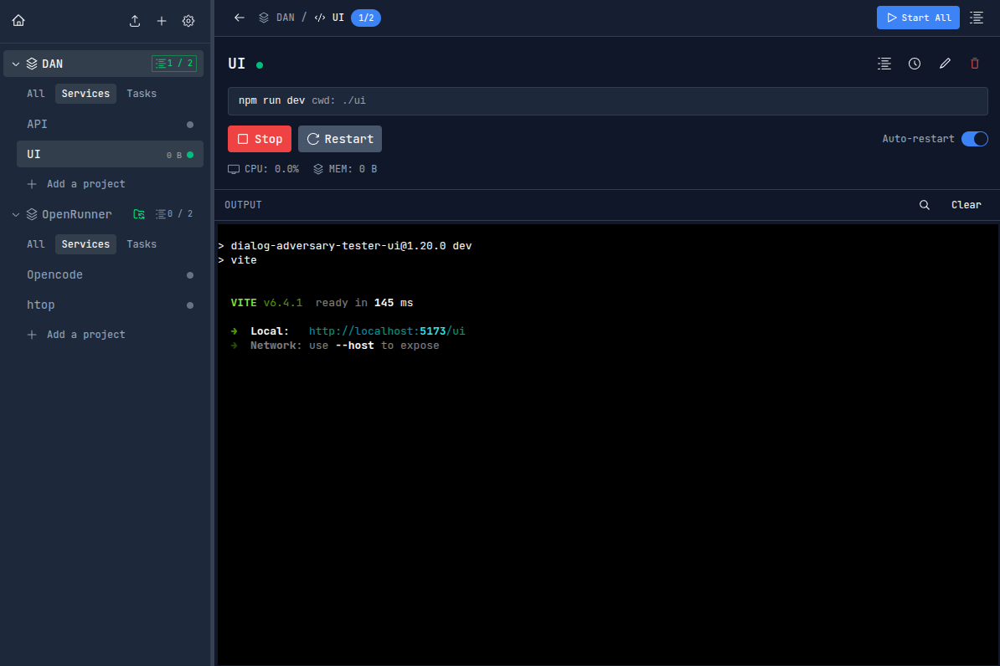

# OpenRunner



**OpenRunner** is a desktop application that helps developers organize and run their terminal commands. Think of it as a mission control for your development workflows - no more hunting through shell history or keeping notes in text files.

> **Note:** This project is in active development. Features are still being added and may change.

## What It Does

OpenRunner lets you create **groups** and **projects** to organize commands that you run frequently:

- **Groups** are collections of related projects (like "Work", "Personal", or "Client Projects")
- **Projects** contain the commands you want to run (like "API Server", "Frontend Dev", "Database")

Each project can have multiple commands that run in sequence or in parallel, with full terminal output right in the app.

## Features

### 🖥️ CLI (Command-Line Interface)

OpenRunner includes a powerful CLI for quick project setup:

```bash
# Auto-detect projects in current directory
openrunner new .

# Preview what would be added (without modifying)
openrunner new . --dry-run

# Specify a custom group name
openrunner new . --name "My Projects"

# Get help
openrunner --help
```

**Supported Project Types:**
- **JavaScript/TypeScript**: package.json (npm scripts)
- **Make**: Makefile targets
- **Docker**: docker-compose.yml, Dockerfile
- **Python**: requirements.txt, pyproject.toml, Pipfile
- **Rust**: Cargo.toml (with workspace support)
- **Go**: go.mod
- **Task Runners**: Justfile, Taskfile.yml

### 🗂️ Organized Workflows
- Create unlimited groups and projects
- Drag-and-drop to reorder items
- Collapse groups to reduce clutter
- Favorites for quick access

### 🖥️ Built-in Terminal
- Full terminal emulation with xterm.js
- Automatic scrolling with option to pause
- Clear output with one click
- Dark theme designed for long coding sessions

### 📊 Process Monitoring
- See CPU and memory usage in real-time
- Charts showing resource usage over time
- Automatic process cleanup on shutdown

### 💾 Smart Persistence
- Everything saves automatically
- SQLite database for logs and history
- JSON file for your configuration
- Works offline - no cloud required

### ⌨️ Developer-Friendly
- Keyboard shortcuts for common actions
- Custom working directories per project
- Environment variable support
- Sequential command execution (one fails, stop the rest)

## Getting Started

### Quick Start

Download the latest release for your platform from the [Releases](https://github.com/yourusername/openrunner/releases) page.

### Building from Source

Want to run the development version or contribute?

See [BUILDING.md](BUILDING.md) for detailed instructions.

**Quick start for developers:**

```bash
git clone https://github.com/yourusername/openrunner.git
cd openrunner
pnpm install
pnpm dev
```

## Usage

### Creating Your First Project

1. **Create a Group**: Right-click in the sidebar and select "New Group"
2. **Add a Project**: Right-click on your group and select "New Project"
3. **Add Commands**: Click the project to open it, then add your shell commands
4. **Run**: Click the play button to start your project

### Managing Projects

- **Start/Stop**: Click the play/stop buttons in the project header
- **Reorder**: Drag items in the sidebar to reorganize
- **Delete**: Right-click and select "Delete" (or use keyboard shortcuts)
- **Edit**: Double-click names to rename inline

### Tips

- Projects can run multiple commands in sequence - if one fails, the rest stop
- Use the "Expand All" button when you have many groups
- The terminal pauses auto-scroll if you scroll up - click "Resume Auto Scroll" to continue
- Monitor resources to catch runaway processes early

## Tech Stack

OpenRunner is built with modern web technologies packaged as a desktop app:

- **Frontend**: Vue 3 with TypeScript and Tailwind CSS
- **Backend**: Electron with Node.js/TypeScript
- **Terminal**: xterm.js for terminal emulation
- **Charts**: Chart.js for resource monitoring
- **Database**: SQLite (better-sqlite3) for persistence

## Contributing

We welcome contributions of all kinds - bug reports, feature requests, documentation improvements, and code.

See [CONTRIBUTING.md](CONTRIBUTING.md) for:
- How to report bugs
- How to suggest features
- Development setup instructions
- Code style guidelines
- Pull request process

## License

OpenRunner is released under the [MIT License](LICENSE).

## Acknowledgments

- Built with [Electron](https://www.electronjs.org/) - cross-platform desktop framework
- Terminal powered by [xterm.js](https://xtermjs.org/)
- Charts by [Chart.js](https://www.chartjs.org/)
- UI styled with [Tailwind CSS](https://tailwindcss.com/)

---

**Made with ❤️ by developers, for developers.**

Got questions? Open an issue or start a discussion. We'd love to hear from you!
